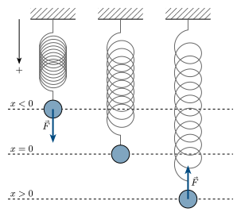
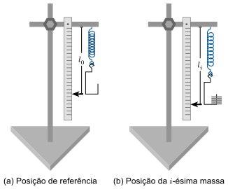

::: {.content-visible when-format="html"}
## Introdução

Considere a situação mostrada na @fig-sistema-massa-mola, em que temos uma mola, fixa em uma extremidade. Na outra extremidade da mola, há uma massa $m$. No centro, o sistema está na posição de equilíbrio $x = 0$ e a mola não está nem comprimida nem alongada. Quando a mola é comprimida ($x<0$) ou alongada ($x>0$), surge uma força restauradora $\vec{F}$ orientada em sentido contrário à elongação, tendendo a retornar a massa à posição de equilíbrio [@Halliday2].


::: {#fig-sistema-massa-mola}


<div style="text-align: center;">
  **Fonte:** Labfis (2026)
</div>
:::

O comportamento descrito acima é regido pela *lei de Hooke*,  segundo a qual a intensidade da força restauradora $F$ é diretamente proporcional à elongação $x$ sofrida pela mola, mas de sentido contrário, ou seja,


$$
  F = -k x
$${#eq-lei-de-hooke}

em que $k$ é a _constante elástica_ da mola (expressa em N/m).


A lei de Hooke é válida dentro do limite de elasticidade da mola. Nesse regime, o gráfico do módulo da força $F$ em função da elongação $x$ é linear, e seu coeficiente angular corresponde à constante elástica $k$. 

Neste experimento, massas previamente aferidas são adicionadas progressivamente à mola, e as respectivas elongações são medidas para determinar experimentalmente sua constante elástica e avaliar a linearidade do comportamento por meio da análise gráfica.


## Objetivos

1. Determinar a constante elástica $k$ de uma mola helicoidal utilizando o método estático;
2. Validar a linearidade da Lei de Hooke por meio da análise gráfica.

## Material necessário

::: {#fig-aparato-experimental}


<div style="text-align: center;">
  **Fonte:** Labfis (2026)
</div>
:::

- Suporte universal e acessórios;
- Mola helicoidal;
- Massas acopláveis;
- Balança digital;
- Régua ou trena.

## Referências

:::{#refs}
:::
::::


```{=typst}
#show bibliography: it => {
  show heading: none
  it
}

= Introdução


Considere a situação mostrada na @fig-sistema-massa-mola, em que temos uma mola, fixa em uma extremidade. Na outra extremidade da mola, há uma massa $m$. No centro, o sistema está na posição de equilíbrio $x = 0$ e a mola não está nem comprimida nem alongada. Quando a mola é comprimida ($x<0$) ou alongada ($x>0$), surge uma força restauradora $arrow(F)$ orientada em sentido contrário à elongação, tendendo a retornar a massa à posição de equilíbrio @Halliday2.


#figure(
  image("assets/images/typst/sistema-massa-mola.svg", width: 75%),
  caption: [Força elástica em uma mola]
)<fig-sistema-massa-mola>

O comportamento descrito acima é regido pela *lei de Hooke*,  segundo a qual a intensidade da força restauradora $F$ é diretamente proporcional à elongação $x$ sofrida pela mola, mas de sentido contrário, ou seja,


$
  F = -k x
$<eq-lei-de-hooke>

#par(first-line-indent: 0cm)[em que $k$ é a _constante elástica_ da mola (expressa em N/m).]

A lei de Hooke é válida dentro do limite de elasticidade da mola. Nesse regime, o gráfico da força $F$ em função da elongação $x$ é linear, e seu coeficiente angular corresponde à constante elástica $k$. 

Neste experimento, massas previamente aferidas são adicionadas progressivamente à mola, e as respectivas elongações são medidas para determinar experimentalmente sua constante elástica e avaliar a linearidade do comportamento por meio da análise gráfica.


= Objetivos

+ Determinar a constante elástica $k$ de uma mola helicoidal utilizando o método estático;
+ Validar a linearidade da Lei de Hooke por meio da análise gráfica.

= Material necessário


- Suporte universal e acessórios;
- Mola helicoidal;
- Massas acopláveis;
- Balança digital;
- Régua ou trena.


#figure(
  image("assets/images/typst/equipamento-massa-mola-2.svg", width: 80%),
  caption: [Aparato experimental]
)<fig-aparato-experimental>


= Procedimentos

+ Identifique e numere as 10 anilhas. Meça suas massas $m_1$ a $m_(10)$ com a balança digital e registre os valores, em gramas (g), na @tbl-coleta-dados.
+ Monte o suporte universal com a mola na vertical e acople o porta-pesos vazio à sua extremidade inferior.
+ Após o sistema (mola + suporte porta-pesos) atingir o repouso, registre a leitura inicial $l_0$ na escala da régua. Essa leitura inclui a elongação causada pelo porta-pesos (veja @fig-aparato-experimental(a)).
+ Adicione progressivamente as anilhas, na ordem de numeração.
+ Após cada adição, aguarde o sistema atingir o repouso e registre a leitura $l_i$ da escala, conforme @fig-aparato-experimental(b).
+ Calcule a elongação da mola por
  $x_i = l_i - l_0$.
+ Para cada etapa, calcule a massa acumulada
  $M_i = sum_(j=1)^i m_j$,
  converta-a para quilogramas e determine a força peso
  $F_i = M_i g$.


= Resultados

+ Construa o gráfico do módulo da $F$ (eixo vertical) em função da elongação $x$ (eixo horizontal).
+ Trace a reta de ajuste linear dos pontos experimentais; o coeficiente angular dessa reta fornecerá o valor da constante elástica $k$ da mola.
+ Avalie a linearidade do gráfico obtido por meio, por exemplo, do coeficiente de determinação ($R^2$). Caso o valor de $R^2$ seja próximo de 1, a proporcionalidade direta da Lei de Hooke está validada para o intervalo testado. Discuta os resultados.


#set heading(numbering: none)
= Referências

#bibliography("assets/references/references.bib", style: "assets/references/abnt.csl", title: none)

#set table(
  align: center+top
)


#place(
  bottom,
  float: true,
  scope: "parent", 
  clearance: 1.5em
)[
  #figure(
    kind: table,
    caption: [Coleta de dados],
  )[
    #table(
      columns: (0.6fr, 1fr, 1fr, 1fr, 1fr, 1fr),
      table.header([Etapa], [$m_i$ (g)], [$M_i$ (kg)], [$l_i$ (m)], [$x$ (m)], [$F$ (N)]),
      [$0$], [$-$], [$-$], [], [$-$], [$-$],
      [$1$], [], [], [], [], [],
      [$2$], [], [], [], [], [],
      [$3$], [], [], [], [], [],
      [$4$], [], [], [], [], [],
      [$5$], [], [], [], [], [],
      [$6$], [], [], [], [], [],
      [$7$], [], [], [], [], [],
      [$8$], [], [], [], [], [],
      [$9$], [], [], [], [], [],
      [$10$], [], [], [], [], [],
      //table.cell(colspan: 2)[*Média*]
    )
  ]<tbl-coleta-dados>
]
```